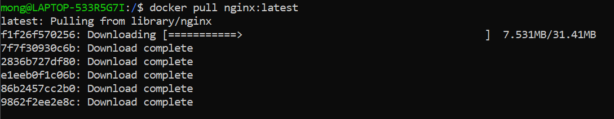

- # Travail
- Docker installé
- Hello-world lancé
- nginx version 1.22-alpine-slim pulled
- nginx lastest impossible a pull
- 
-
- Lancé nginx
- docker run -p 80:80 --name nginx1 nginx:1.22-alpine-slim
- Impossible de pull d'autres versions (1.23.4, 1.23-perl, default)
- # Présentation Malo
- ## 1.plan
- jira: outils pr suivre avancement des taches
- Objectifs a 2 semaines
- ## 2.code
- vscode + docker
- gitflow/trunk base
- ## 3.build
- docker--> amazon ECR --> argo --> kubernetes
- ## 4.test
- ## 5.release
- ## 6.deploy
- ## 7.operate
- ## 8.monitor
- amazon cloudwatch
- datadog
-