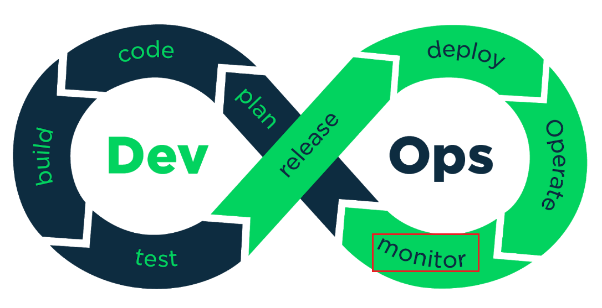
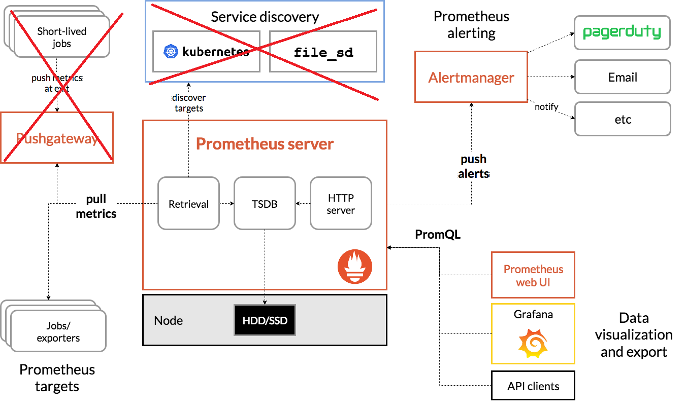

- # Presentation monitoring
- 
-
- But: Comprendre ce qui se passe dans l'application
- Prometheus-Grafana stack
- 
	-
	-
- ## Grafana tutorial
	- Outil de dashboard, visuels
	- https://grafana.com/tutorials/grafana-fundamentals/
	- Métriques: nb de connections actives, temps de réponses,...
	-
	-
- monitoring de requetes sur localhost:8081
- 
-
- 
- alerting automatique
- 
- {:height 351, :width 623}
- ## Prometheus
- Tutorial: https://prometheus.io/docs/prometheus/latest/getting_started/
- Développé chez Soundcloud
- Largement en GO
- Outil de monitoring et d'alerte
- Collection de métriques numériques sous forme de séries temporelles (time series)
- PromQL
- modèle pull via HTTP
- 
- ## Plus
- Designed for reliability
- Collection de données multidimensionnelles
- ## Moins
- 100% fiable mais pas 100% précis, pas assez pour facturation
- ## Prometheus Exporter
- ### Exportation de metrics d'une application
- Personnalisation des metrics de l'application
-
- Lien vers documentation:
- https://grafana.com/oss/prometheus/exporters/
- https://prometheus.io/docs/instrumenting/exporters/
-
- Tuto :
- https://acloudguru.com/hands-on-labs/collecting-application-metrics-with-prometheus
-
- ## Exemple réalisé sur application Laravel
- Resources uilisées:
- https://grafana.com/grafana/dashboards/11034-laravel-horizon/
- https://github.com/lkaemmerling/laravel-horizon-prometheus-exporter
-
- Configuration de l'application:
	- - composer require lkaemmerling/laravel-horizon-prometheus-exporter
- Configuration de prometheus:
	- - vi /opt/homebrew/etc/prometheus.yml
- 
-
- #### Résultat
- http://localhost:8000/metrics :
- 
-
- Grafana:
- 
-