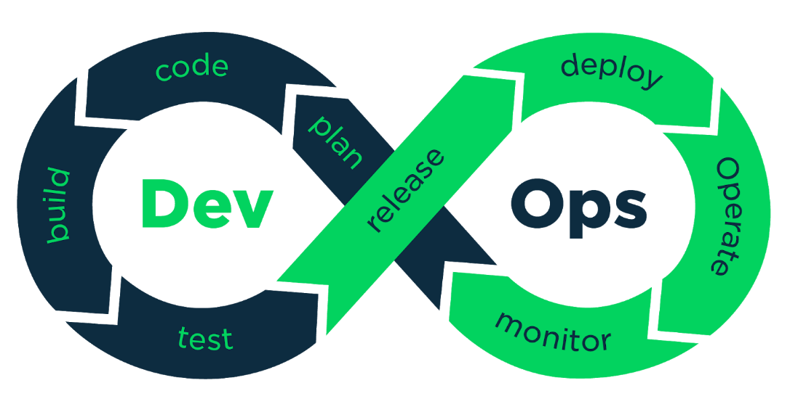
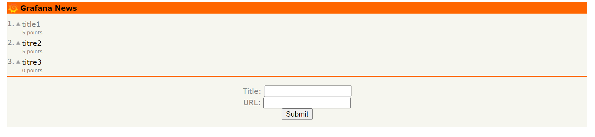
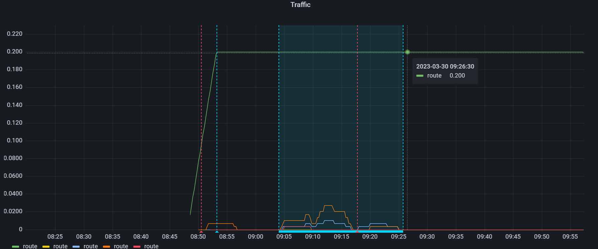
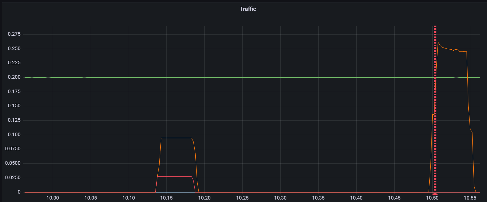
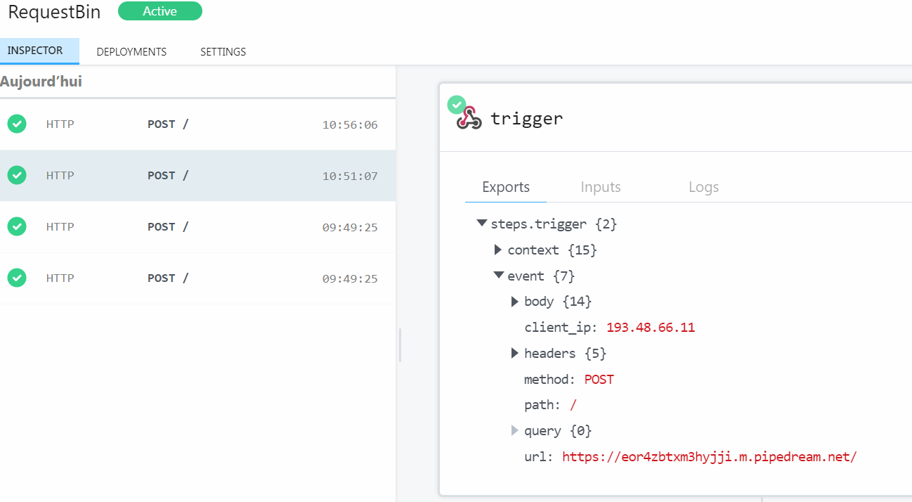
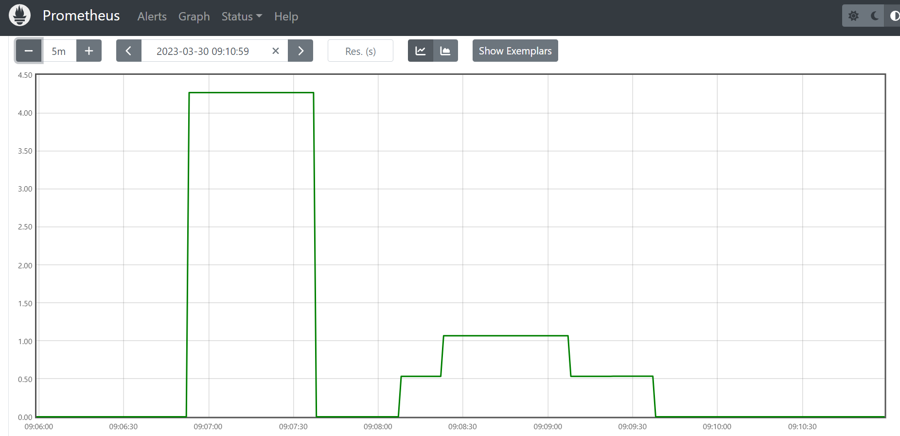

- # Presentation monitoring
- 
-
- ## Grafana tutorial
	-
- https://grafana.com/tutorials/grafana-fundamentals/
- Prometheus-Grafana stack
- monitoring de requetes sur localhost:8081
- 
-
- 
- definir métriques
- alerting automatique
- 
- {:height 351, :width 623}
- ## Prometheus
- 
-
-
-